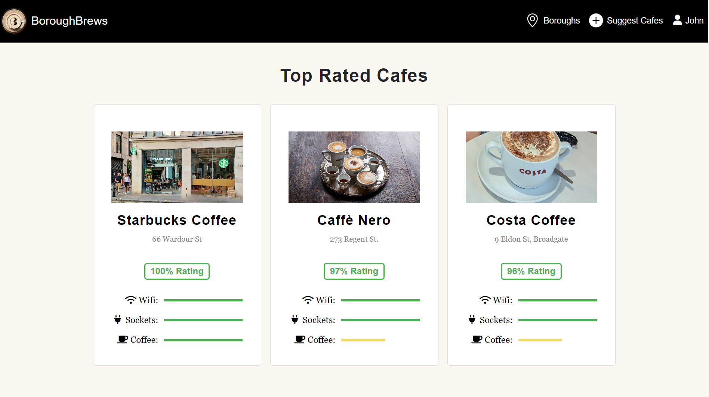
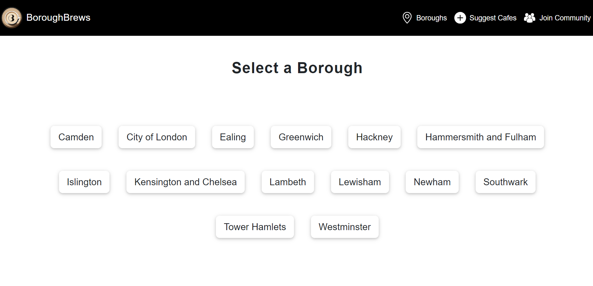
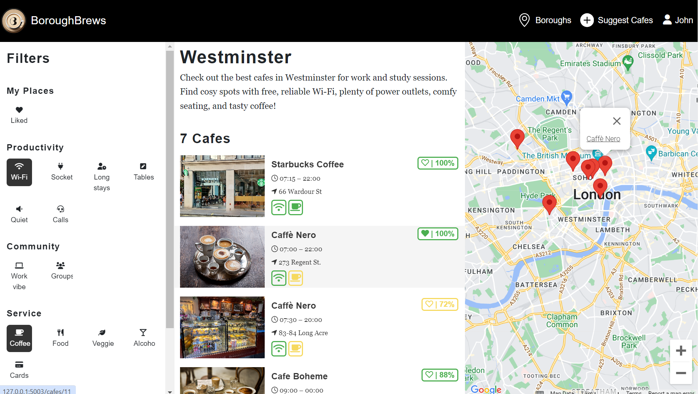
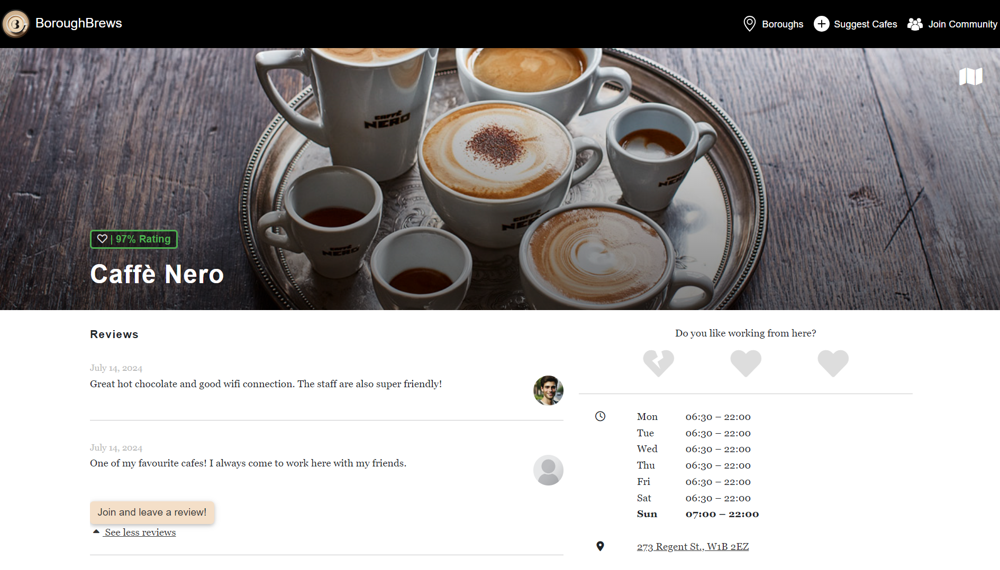
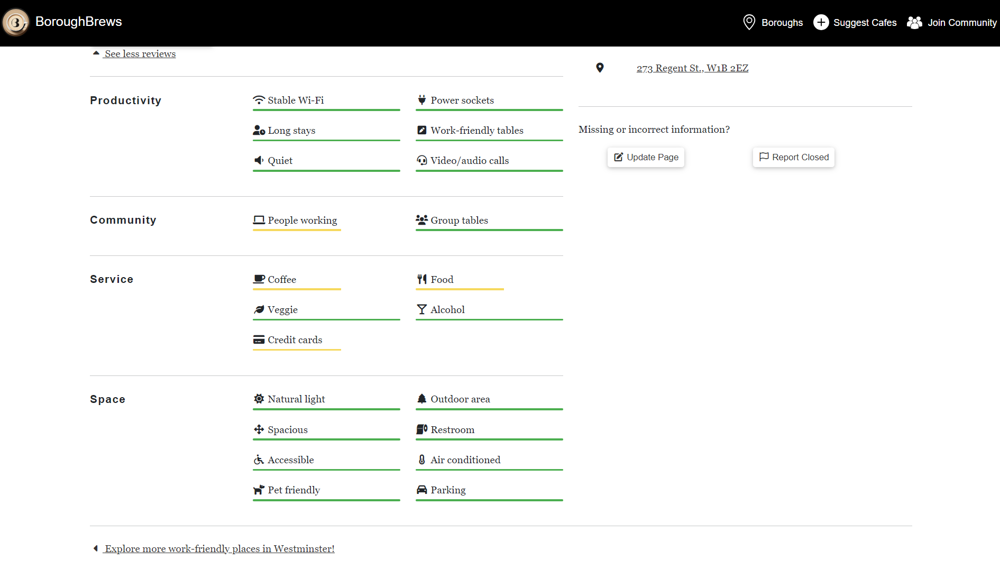
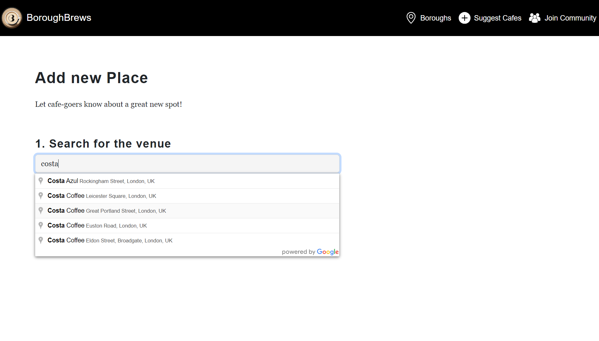
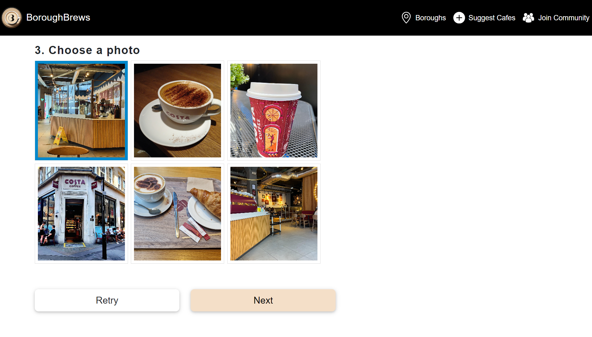
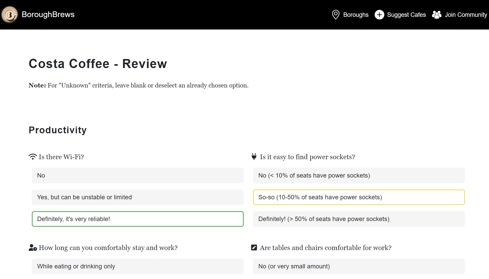

# BoroughBrews

BoroughBrews is a website that helps users find cafes in different boroughs of London. Users can add cafes to the database, leave reviews, and rate criteria such as wifi quality and coffee taste.

## Link

Visit [BoroughBrews](https://boroughbrews.onrender.com/) to start exploring cafes in London!

## Key Features

- **Browse Cafes**: Explore cafes categorised by boroughs in London.
- **Suggest Cafes**: Users can contribute by adding new cafes to the database.
- **Review and Rate**: Leave reviews and rate cafes based on criteria.
- **Filter Cafes**: Easily find cafes that meet specific criteria.
- **Cafe Details**: View detailed information about cafes, including opening times, Google Maps links, user reviews and ratings.

## Screenshots

1. **Homepage**
   
   
   *Shows the main interface of BoroughBrews where users first land.*

   
   *Shows the top rated cafes on the site.*

2. **Select Borough**
    
   *Users can select a borough to see all cafes listed in that area.*

3. **Cafe Listing in a Borough**
   
   *Displays cafes listed in a particular borough, allowing users to browse and filter based on criteria.*

4. **Cafe Details**
   
   
   *Provides detailed information about a specific cafe, including opening times, location, reviews and ratings.*

5. **Suggest Cafe Form**
   
   
   *Illustrates the form where users can suggest new cafes to be added to the database.*

6. **Rating Cafe Criteria Form**
   
   *Shows the form for users to rate cafes based on criteria.*
